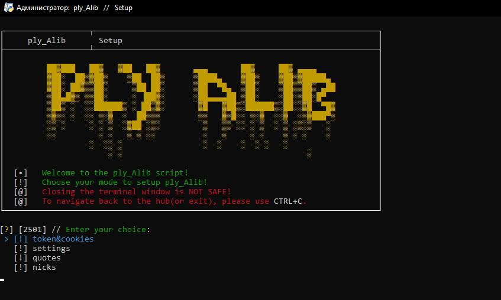

# ♿ ply_Alib
###### An open-source script for improving WRP forum experience
_powered by 2501_

------

## The script contains such functions as:

- 🔧 |  Flexible settings & customization
  - Full setup of the script through the CLI
  - Semi-automatic token and cookie loading via GUI
  - Automatic generation of bios and nicknames

- 💻 |  Server monitoring
  - Delay setting
  - Automatic update

- ♿ |  Main script
  - Wide range of customisation in nickname and bio 
  - Delay setting
  - Return default nickname and bios after script termination
  - Automatic & constant update
  
- 🎭 |  Personal AI
  - Borderless AI's answer to your questions
  - Personality and ability to change system prompt in files
  - View discussions via only id in CLI
  - Tracing a phone number
  - Terminal functions

- 💎 |  Others
  - Start all functions at the same time
  - Discord integration
  - Anonymous startup mode
  - Easter eggs

## Installation

**1.** Download or clone repository.
```batch
cd Desktop
git clone https://github.com/v1lmok/ply_alib.git
```

**2.** Make sure you have Python installed.

**3.** Launch: `setup(requirements).py` and wait for the dependency installation to complete.

**4.** Launch `run.py` in the initial directory.

**5.** Setup the script for the first time.

**6.** Congratulations! Restart the script to work properly and listen to the instructions on the screen. ***(Help and tutorials are below)***
 
## Credits

- Idea mastermind, coder :: Star boy > [Github](https://github.com/v1lmok) // [WRP Forum](https://forum.wayzer.ru/u/vilmok)
- Provider, coder, design :: Стив Пиво > [Github](https://github.com/PivoSteve) // [WRP Forum](https://forum.wayzer.ru/u/Buba)

## Media

##### Tutorial: Installation
<iframe width="660" height="375" src="https://www.youtube.com/embed/-ewjSZvIwkc" title="Installation | Video tutorial" frameborder="0" allow="accelerometer; autoplay; clipboard-write; encrypted-media; gyroscope; picture-in-picture; web-share" referrerpolicy="strict-origin-when-cross-origin" allowfullscreen></iframe>

##### Tutorial: cURL for Token&Cookies setup
<iframe width="660" height="375" src="https://www.youtube.com/embed/4qT4BbN-yNU" title="Installation | Video tutorial" frameborder="0" allow="accelerometer; autoplay; clipboard-write; encrypted-media; gyroscope; picture-in-picture; web-share" referrerpolicy="strict-origin-when-cross-origin" allowfullscreen></iframe>

##### Hub menu:


#### Setup hub:


#### Main hub:
