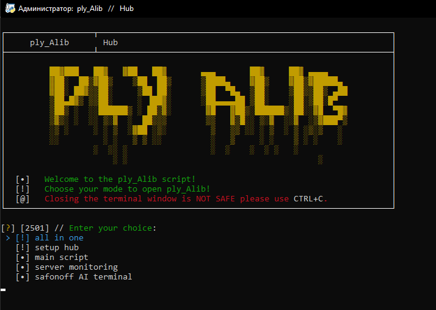
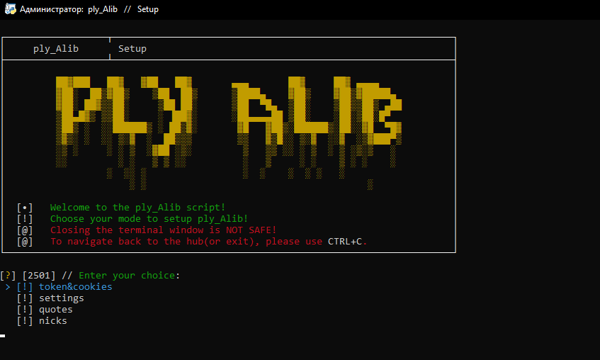
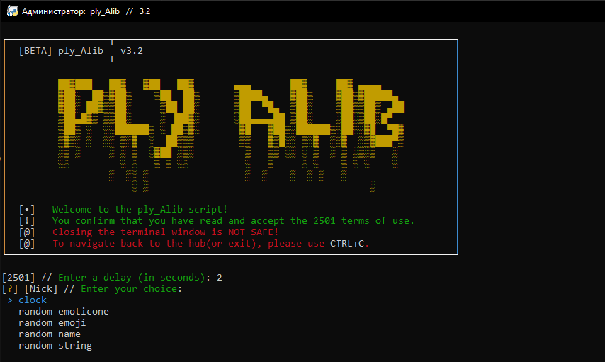

# ♿ ply_Alib
###### Скрипт с открытым исходным кодом для улучшения использования форума WRP.
_powered by 2501_

------


## Скрипт содержит такие функции, как:

- 🔧 | Гибкие настройки и кастомизация
  - Полная настройка скрипта через CLI
  - Полуавтоматическая загрузка токенов и куки через GUI
  - Автоматическая генерация био и никнеймов

- 💻 | Мониторинг сервера
  - Настройка задержки
  - Автоматическое обновление

- ♿ | Основной скрипт
  - Широкие возможности настройки никнейма и био 
  - Настройка задержки
  - Возврат никнейма и био по умолчанию после завершения работы скрипта
  - Автоматическое и постоянное обновление
  
- 🎭 | Персональный ИИ
  - Безграничный ИИ отвечает на ваши вопросы
  - Личность и возможность изменять системную подсказку в файлах
  - Просмотр обсуждений по единственному идентификатору в CLI
  - Отслеживание телефонного номера
  - Функции терминала

- 💎 | Другие
  - Одновременный запуск всех функций
  - Интеграция Discord
  - Анонимный режим запуска
  - Пасхалки

## Установка

**1.** Скачайте или клонируйте репозиторий.
``batch
cd Desktop
git clone https://github.com/v1lmok/ply_alib.git
```

**2.** Убедитесь, что у вас установлен Python.

**3.** Запустите: `setup(requirements).py` и дождитесь завершения установки зависимостей.

**4.** Запустите `run.py` в начальной директории.

**5.** Установите скрипт в первый раз.

**6.** Поздравляем! Перезапустите скрипт для корректной работы и слушайте инструкции на экране. ***(Помощь и туториалы находятся ниже)***
 
## Создатели

- Идейный вдохновитель, кодер :: Star boy > [Github](https://github.com/v1lmok) // [WRP Forum](https://forum.wayzer.ru/u/vilmok)
- Провайдер, кодер, дизайн :: Стив Пиво > [Github](https://github.com/PivoSteve) // [WRP Forum](https://forum.wayzer.ru/u/Buba)

## Медиа

##### Туториал: Установка
https://www.youtube.com/watch?v=-ewjSZvIwkc

##### Туториал: cURL для настройки Token&Cookies
https://www.youtube.com/watch?v=4qT4BbN-yNU

##### Меню:


#### Настройка:


#### Главный скрипт:
